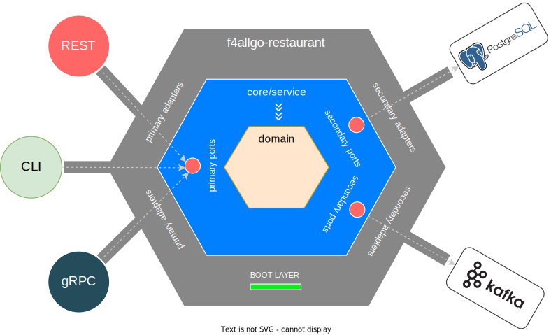

# f4allgo-restaurant

The `f4allgo-restaurant` service.

The `f4allgo project` is just a personal exercise to reimplement the [ftgo-application](https://github.com/microservices-patterns/ftgo-application) but with gopher eyes.